# Sử dụng L1 cache in Hibernate

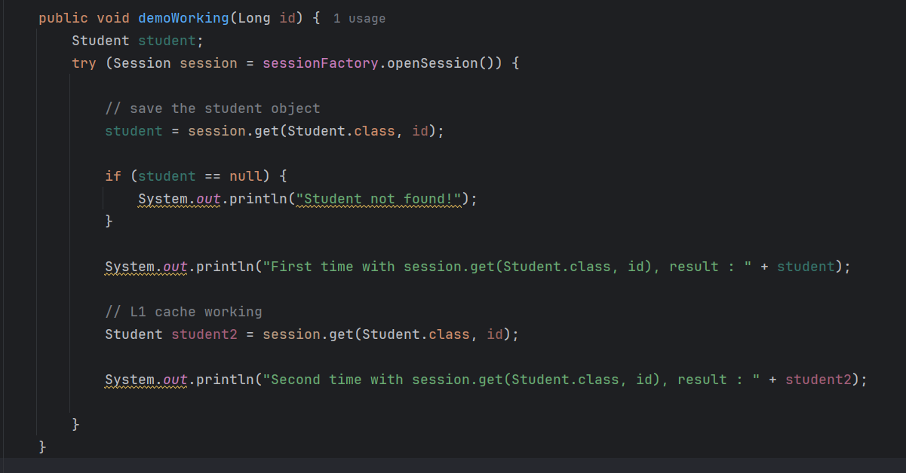

# L1 cache không hoạt động trong trường hợp sau.

Commit 2

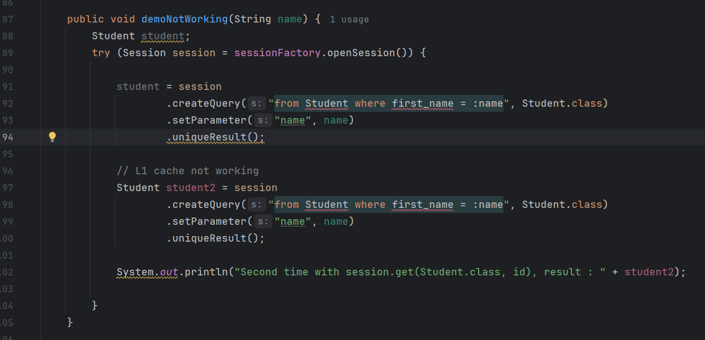

#  Flush cache trong hibernate - no transaction

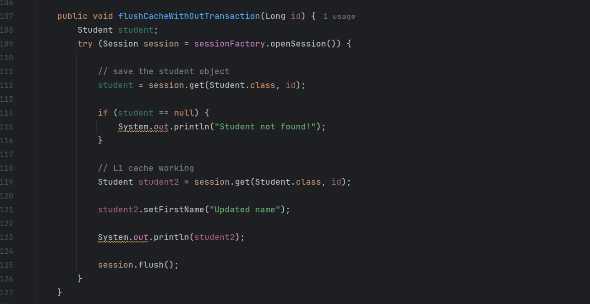

#  Flush cache trong hibernate - transaction
### Theo config mặc định trong hibernate `session.flush()` sẽ được thực thi trước `transaction.commit()`
### Hibernate có các flush mode sau:

- `ALWAYS` - luôn luôn flush trước khi query
- `AUTO` - mặc định, flush trước khi query nếu cần
- `COMMIT` - flush trước khi commit transaction
- `MANUAL` - chỉ flush khi gọi `session.flush()`

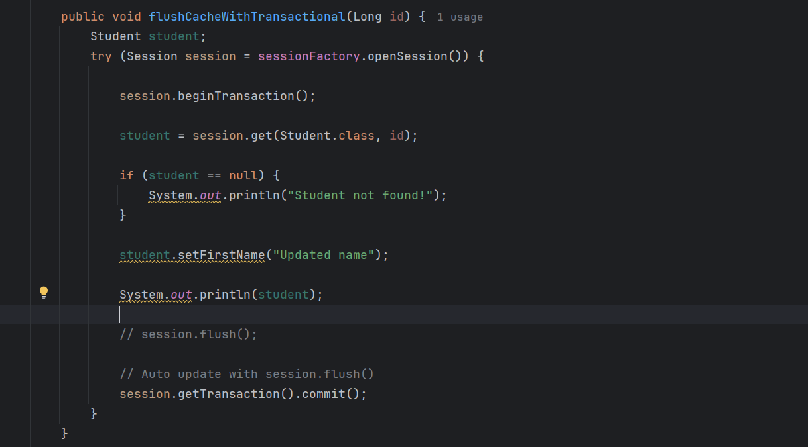

#  Test trường hợp transaction commit nhưng không flush cache

### Tại điểm debug đầu tiên
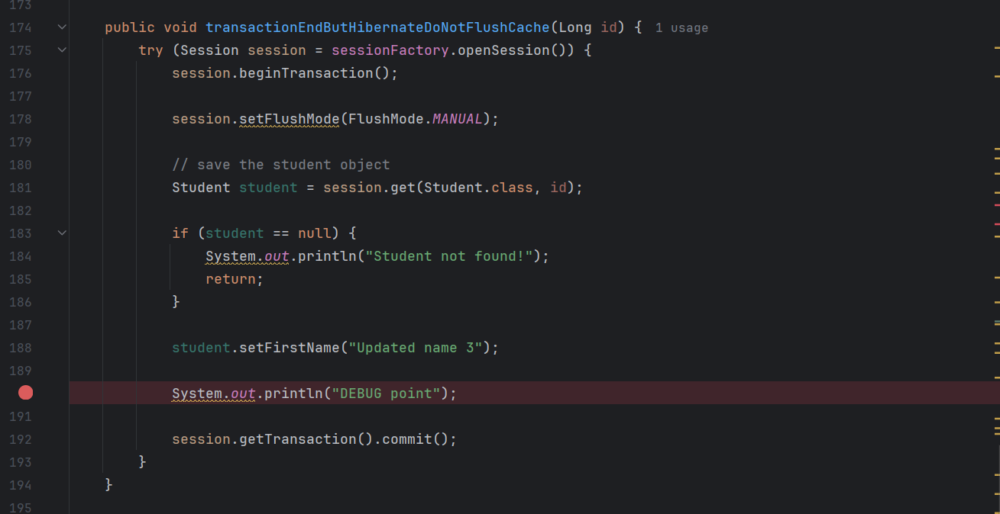
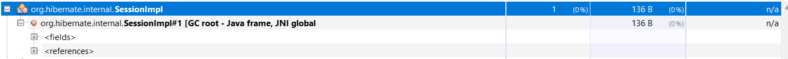
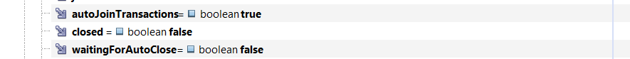
  - Object Session đang được sử dụng và có biến closed = false
  - Config flush mode = MANUAL và không gọi session.flush() trước khi commit transaction

### Tại điểm debug thứ hai
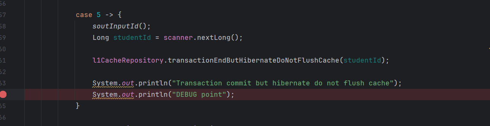
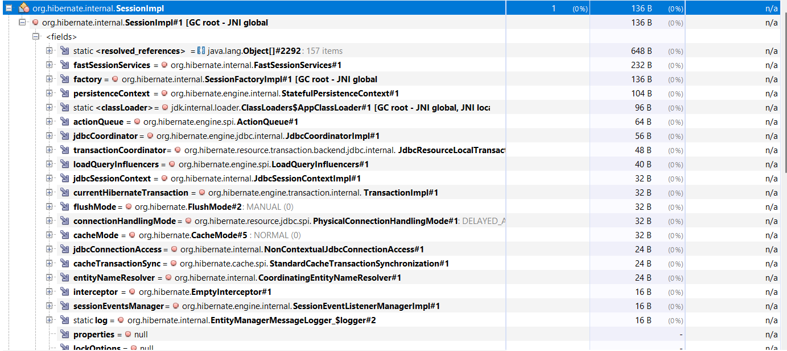
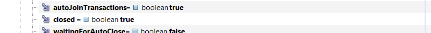
  - Sau khi thoát khỏi hàm thì Object Session đã được đóng, biến closed = true

### Sau khi thoát ra khỏi controller
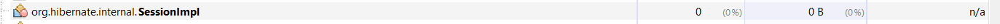
  - Object Session đã được clear bởi GC

